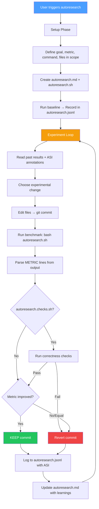

# Autoresearch AI Plugin

> **Autonomous Experiment Loops for Claude Code — Let AI optimize while you sleep**


Edit code → commit → run benchmark → measure metric → keep improvement or revert → **repeat forever**.

Works for **any optimization target**: LLM training loss, test speed, bundle size, build time, Lighthouse scores, and more.

Inspired by [Karpathy's autoresearch](https://github.com/karpathy/autoresearch), [pi-autoresearch](https://github.com/davebcn87/pi-autoresearch), and [litesearch](https://github.com/jlippp/litesearch).

## Skills

This plugin provides two skills that work together. **Autoresearch** is the core engine (works for any metric), and **Autoresearch ML** extends it with GPU-specific templates for LLM training.

### 1. Autoresearch (The Optimizer)

*Domain-agnostic autonomous experiment loop.*

- **Edit → Measure → Keep/Discard**: Autonomous cycle that edits code, runs benchmarks, and keeps only improvements.
- **Context-Resilient**: State persists in `autoresearch.jsonl` — survives context resets and session restarts.
- **Confidence Scoring**: MAD-based statistical analysis separates real improvements from measurement noise.
- **ASI (Actionable Side Information)**: Structured annotations per experiment that survive git reverts — the only memory of discarded experiments.
- **Secondary Metrics**: Track tradeoff metrics (memory, compile time) alongside the primary optimization target.
- **Segments**: Multi-phase sessions — switch optimization targets mid-session without losing history.
- **Cancel & Status**: Check progress or stop the loop at any time while preserving experiment history.
- **Any Metric**: Test speed, bundle size, build time, Lighthouse scores, memory usage — if you can measure it, you can optimize it.

### 2. Autoresearch ML (The Researcher)

*Specialized for LLM training with NVIDIA GPUs. Extends the core Autoresearch skill.*

- **Ready-to-Use Template**: Complete LLM pretraining setup based on Karpathy's autoresearch (GPT + Flash Attention + MuonAdamW).
- **Consumer to Datacenter GPUs**: Supports NVIDIA GPUs from 4GB (GTX 1080 Ti) to 80GB (H100) with automatic VRAM scaling guidance.
- **Fixed Time Budget**: Every experiment runs for exactly 5 minutes — all results are directly comparable.
- **Bits Per Byte**: Vocab-size-independent metric (`val_bpb`) enables fair comparison across architectures.

---

## Quick Start

### Prerequisites

- **Git** — experiments use git commit/revert for state management
- **For ML skill:** NVIDIA GPU with 8GB+ VRAM, CUDA 12.0+, Python 3.10+, [uv](https://astral.sh/uv)

### Installation

#### Option 1: CLI Install (Recommended)

Use [npx skills](https://github.com/vercel-labs/skills) to install skills directly:

```bash
# Install all skills
npx skills add proyecto26/autoresearch-ai-plugin

# Install specific skills
npx skills add proyecto26/autoresearch-ai-plugin --skill autoresearch autoresearch-ml

# List available skills
npx skills add proyecto26/autoresearch-ai-plugin --list
```

This automatically installs to your `.claude/skills/` directory.

#### Option 2: Claude Code Plugin

Install via Claude Code's built-in plugin system:

```bash
# Add the marketplace
/plugin marketplace add proyecto26/autoresearch-ai-plugin

# Install the plugin
/plugin install autoresearch-ai-plugin
```

#### Option 3: Clone and Copy

```bash
git clone https://github.com/proyecto26/autoresearch-ai-plugin.git
cp -r autoresearch-ai-plugin/skills/* .claude/skills/
```

#### Option 4: Git Submodule

Add as a submodule for easy updates:

```bash
git submodule add https://github.com/proyecto26/autoresearch-ai-plugin.git .claude/autoresearch-ai-plugin
```

Then reference skills from `.claude/autoresearch-ai-plugin/skills/`.

#### Option 5: Fork and Customize

1. Fork this repository
2. Customize skills for your specific needs (add new metrics, change templates)
3. Clone your fork into your projects

### Usage Examples

**"Run autoresearch to optimize my test suite"**
> Triggers **Autoresearch** to set up a benchmark loop, measure test runtime, and iteratively optimize your test configuration.

**"Start an experiment loop to reduce bundle size"**
> Triggers **Autoresearch** to measure your build output and autonomously try tree-shaking, code splitting, and dependency optimizations.

**"Set up ML autoresearch with my RTX 4090"**
> Triggers **Autoresearch ML** to copy the training assets, prepare data, and begin autonomous LLM pretraining experiments.

**"Optimize val_bpb autonomously overnight"**
> Triggers **Autoresearch ML** to run 5-minute training experiments in a loop, keeping architecture and hyperparameter improvements.

**"What's the autoresearch status?"**
> Shows a summary of the current session: total runs, kept improvements, best metric, confidence score.

---

## How It Works



**Context resets?** No problem. `autoresearch.jsonl` + `autoresearch.md` contain everything needed to resume — including ASI annotations from discarded experiments.

---

## Configuration

Create `.claude/autoresearch-ai-plugin.local.md` in your project root for persistent settings:

```markdown
---
enabled: true
max_iterations: 50
working_dir: "/path/to/project"
benchmark_timeout: 600
checks_timeout: 300
---
```

| Field | Default | Description |
|-------|---------|-------------|
| `enabled` | `true` | Whether autoresearch is active |
| `max_iterations` | `0` (unlimited) | Stop after N experiments |
| `working_dir` | current directory | Override directory for experiment files |
| `benchmark_timeout` | `600` | Benchmark timeout in seconds |
| `checks_timeout` | `300` | Correctness checks timeout in seconds |

This file is per-project and should not be committed (add `.claude/*.local.md` to `.gitignore`).

---

## Session Files

| File | Purpose |
|------|---------|
| `autoresearch.md` | Living session doc — goal, metrics, scope, learnings |
| `autoresearch.sh` | Benchmark script outputting `METRIC name=value` lines |
| `autoresearch.checks.sh` | Optional correctness checks (tests, lint, types) |
| `autoresearch.jsonl` | Append-only experiment log with ASI (survives restarts) |
| `autoresearch.ideas.md` | Optional backlog of experiment ideas |
| `.claude/autoresearch-ai-plugin.local.md` | Optional persistent configuration |

---

## JSONL Format

Each experiment is logged as a single JSON line in `autoresearch.jsonl`:

```json
{"run":5,"commit":"abc1234","metric":4230,"metrics":{"compile_ms":1200},"status":"keep","description":"parallelized tests","timestamp":1700000000,"segment":0,"confidence":2.3,"asi":{"hypothesis":"parallel tests reduce wall time","next_action_hint":"try worker pool tuning"}}
```

A config header is written once at setup:

```json
{"type":"config","name":"Optimize tests","metricName":"total_ms","metricUnit":"ms","bestDirection":"lower"}
```

---

## ML Training Assets

The `autoresearch-ml` skill includes a complete LLM pretraining setup in `assets/`:

| File | Role |
|------|------|
| `prepare.py` | Data download, BPE tokenizer training, dataloader with best-fit packing |
| `train.py` | GPT model with Flash Attention 3, RoPE, sliding window attention, MuonAdamW |
| `program.md` | Self-contained agent instructions for the autonomous ML loop |
| `pyproject.toml` | Python dependencies (PyTorch 2.9.1 + CUDA 12.8) |

### Supported GPU Tiers

| Tier | GPUs | VRAM |
|------|------|------|
| **Consumer** | GTX 1080 Ti, RTX 2080 Ti | 11GB |
| **Consumer+** | RTX 3090, RTX 4090 | 24GB |
| **Enthusiast** | RTX 5090 | 32GB |
| **Datacenter** | A100, H100 | 40-80GB |

Consumer GPUs use gradient checkpointing, built-in attention (no Flash Attention dependency), and automatic fp32 fallback for Pascal architectures.

---

## 📂 Structure

```
autoresearch-ai-plugin/
├── .claude-plugin/
│   ├── plugin.json                    # Plugin manifest
│   └── marketplace.json               # Marketplace configuration
└── skills/
    ├── autoresearch/                   # Generic experiment loop
    │   ├── SKILL.md                   # Core skill — edit/measure/keep/discard cycle
    │   ├── scripts/
    │   │   ├── parse-metrics.sh       # Extract METRIC lines from benchmark output
    │   │   └── log-experiment.sh      # Append results to autoresearch.jsonl
    │   ├── references/
    │   │   ├── confidence-scoring.md  # MAD-based noise analysis
    │   │   └── best-practices.md      # Benchmark tips, ASI patterns, experiment strategies
    │   └── examples/
    │       ├── autoresearch.sh        # Example benchmark script (portable)
    │       ├── autoresearch.checks.sh # Example correctness checks
    │       └── autoresearch.md        # Example session document
    └── autoresearch-ml/               # ML/GPU specialization (extends autoresearch)
        ├── SKILL.md                   # ML skill — GPU setup, training workflow
        ├── references/
        │   └── gpu-training-guide.md  # CUDA config, OOM fixes, perf tuning
        └── assets/
            ├── prepare.py             # Data prep (download, tokenizer, dataloader)
            ├── train.py               # GPT model + training loop
            ├── program.md             # Agent instructions for ML loop
            └── pyproject.toml         # Python deps (PyTorch + CUDA)
```

---

## 🌟 Star History

[](https://star-history.com/#proyecto26/autoresearch-ai-plugin-code&Date)

## 💜 Sponsors

This project is free and open source. Sponsors help keep it maintained and growing.

[**Become a Sponsor**](https://github.com/sponsors/proyecto26) | [Sponsorship Program](https://proyecto26.com/sponsors/)

## 🤝 Contribution

When contributing to this repository, please first discuss the change you wish to make via issue,
email, or any other method with the owners of this repository before making a change.
 
Contributions are what make the open-source community such an amazing place to learn, inspire, and create. Any contributions you make are **greatly appreciated** ❤️.
 
You can learn more about how you can contribute to this project in the [contribution guide](https://github.com/proyecto26/.github/blob/master/CONTRIBUTING.md).

## 👍 Credits

- [Karpathy's autoresearch](https://github.com/karpathy/autoresearch) — Original autonomous ML research loop
- [pi-autoresearch](https://github.com/davebcn87/pi-autoresearch) — Generalized experiment loop with streaming, ASI, and confidence scoring
- [litesearch](https://github.com/jlippp/litesearch) — Consumer GPU optimizations and VRAM auto-scaling

## Happy vibe researching 💯
Made with ❤️ by [Proyecto 26](https://proyecto26.com) - Changing the world with small contributions.

One hand can accomplish great things, but many can take you into space and beyond! 🌌

Together we do more, together we are more ❤️ 
